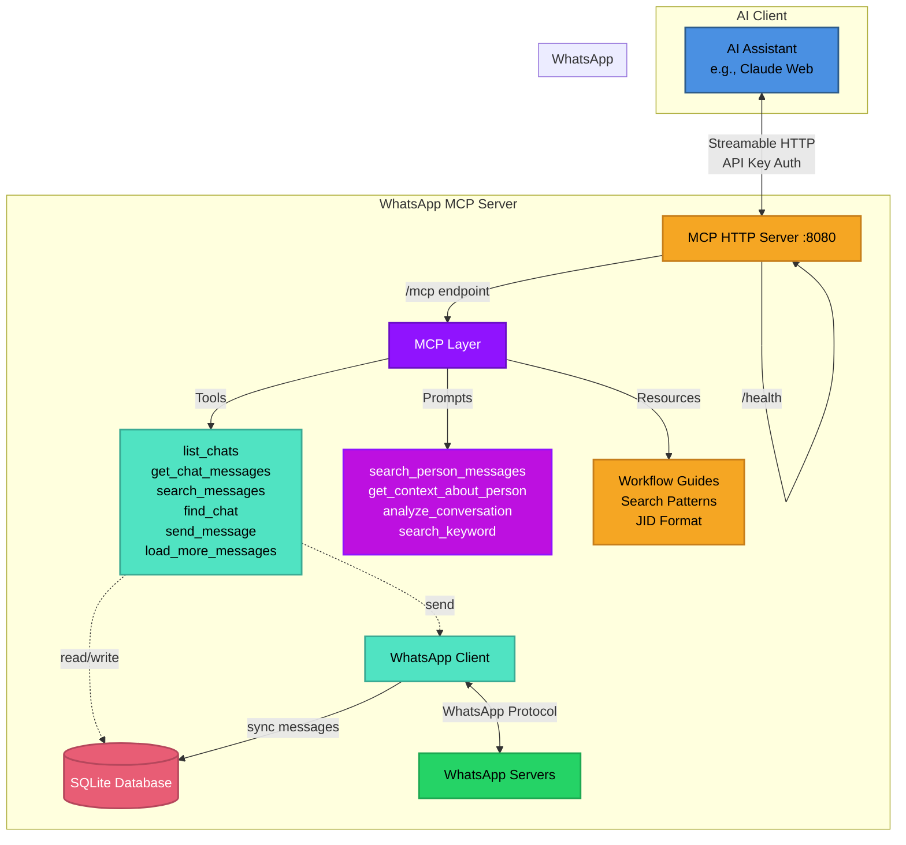

<div align="center">

# WhatsApp MCP Server

**Give AI assistants access to your WhatsApp conversations**

[](https://go.dev/)
[](https://modelcontextprotocol.io)
[](https://www.docker.com/)
[](LICENSE)

*Built with [whatsmeow](https://github.com/tulir/whatsmeow) and [mcp-go](https://github.com/mark3labs/mcp-go)*

[Features](#-features) • [Quick Start](#-quick-start) • [Architecture](#-architecture) • [MCP Integration](#-mcp-integration)

</div>

## 🎯 What is This?

A **Model Context Protocol (MCP) server** that bridges WhatsApp and AI assistants like Claude. It exposes your WhatsApp messages through standardized MCP tools, prompts, and resources - allowing AI to read, search, and send messages on your behalf.

**The Vision:** Let AI handle your WhatsApp conversations intelligently, with full context and natural language understanding.

```
You: "Summarize what João said about the budget meeting"
AI:  *searches all your chats* → "João mentioned in the Tech Team group..."

You: "Reply to Maria's last message and schedule lunch"
AI:  *reads context, sends reply* → "Sent! I've proposed Thursday at noon"
```

## ✨ Features

### Core Capabilities

- **📱 Full WhatsApp Integration** - Connect to WhatsApp Web using your existing account
- **💾 Local-First Storage** - All messages stored in SQLite, synced in real-time
- **🔍 Powerful Search** - Pattern matching, cross-chat queries, sender filtering
- **⏱️ Timezone Support** - Messages displayed in your local timezone
- **📥 On-Demand Loading** - Fetch older messages from WhatsApp servers as needed
- **🔐 Secure by Design** - API key authentication, local data storage, HTTPS ready

### MCP Features

This server implements the full MCP specification with:

- **6 Tools** for WhatsApp operations
- **4 Prompts** for common workflows
- **4 Resources** for interactive guides
- **Server Instructions** for optimal AI interactions

#### Tools

| Tool | Purpose | Highlights |
|------|---------|-----------|
| `list_chats` | Browse conversations | Ordered by recent activity |
| `get_chat_messages` | Read specific chat | Pagination, sender filtering |
| `search_messages` | Search across all chats | Pattern matching, wildcards |
| `find_chat` | Locate chat by name | Fuzzy search support |
| `send_message` | Send WhatsApp messages | To any chat or group |
| `load_more_messages` | Fetch older history | On-demand from servers |

#### Prompts

Pre-built workflows that guide AI assistants:

- **`search_person_messages`** - Find ALL messages from someone across all chats
- **`get_context_about_person`** - Comprehensive analysis of someone's messages
- **`analyze_conversation`** - Summarize recent chat activity
- **`search_keyword`** - Find specific topics across conversations

#### Resources

Interactive documentation embedded in the MCP server:

- **Cross-Chat Search Guide** - Master advanced search workflows
- **Workflow Guide** - Common operations and best practices
- **JID Format Guide** - Understanding WhatsApp identifiers
- **Search Patterns Guide** - Wildcards and pattern matching

## 🏗️ Architecture



### How It Works

1. **Initial Sync** - WhatsApp sends message history on first connection
2. **Real-Time Updates** - All new messages automatically stored in SQLite
3. **MCP Exposure** - Tools, prompts, and resources expose functionality to AI
4. **On-Demand Loading** - Fetch older messages from WhatsApp when needed
5. **AI Integration** - Claude (or any MCP client) accesses WhatsApp through standardized protocol

## 🚀 Quick Start

### Prerequisites

- **Go 1.25.5+** (for local setup) or **Docker** (recommended)
- **WhatsApp account** (will be linked via QR code)
- **MCP-compatible AI client** (Claude, Cursor, etc.)

### Option 1: Docker Setup (Recommended)

1. **Clone and configure**
   ```bash
   git clone https://github.com/felipeadeildo/whatsapp-mcp
   cd whatsapp-mcp
   cp .env.example .env
   # Edit .env with your settings (API key, timezone, etc.)
   ```

2. **Start the server**
   ```bash
   docker compose up -d
   ```

3. **Link WhatsApp**
   ```bash
   # View logs to see QR code
   docker compose logs -f whatsapp-mcp

   # Scan QR code with WhatsApp mobile app:
   # Settings → Linked Devices → Link a Device
   ```

4. **Verify it's running**
   ```bash
   curl http://localhost:8080/health
   # Expected: "OK"
   ```

### Option 2: Local Setup

1. **Install dependencies**
   ```bash
   git clone https://github.com/felipeadeildo/whatsapp-mcp
   cd whatsapp-mcp
   go mod download
   ```

2. **Configure environment**
   ```bash
   cp .env.example .env
   # Edit .env with your settings
   ```

3. **Run the server**
   ```bash
   go run main.go
   ```

4. **Link WhatsApp** (scan QR code shown in terminal)

## 🔌 MCP Integration

### Connect to Claude Desktop

Add to your Claude Desktop config (`~/Library/Application Support/Claude/claude_desktop_config.json`):

```json
{
  "mcpServers": {
    "whatsapp": {
      "url": "http://localhost:8080/mcp/your-secret-api-key",
      "transport": "http"
    }
  }
}
```

### Connect to Other MCP Clients

The server exposes an HTTP+SSE endpoint compatible with any MCP client:

- **URL:** `http://localhost:8080/mcp/{API_KEY}`
- **Transport:** Streamable HTTP
- **Authentication:** API key in URL path

## 🎨 Usage Examples

Once connected, your AI assistant can:

### Search for People
```
You: "Find all messages from Arthur across all my chats"
AI: [Uses search_person_messages prompt]
    → Finds messages in DMs, groups, everywhere
    → Analyzes communication patterns
    → Provides context about Arthur
```

### Analyze Conversations
```
You: "What did we discuss in the Tech Team group this week?"
AI: [Uses analyze_conversation prompt]
    → Reads recent messages
    → Summarizes key topics
    → Lists action items and deadlines
```

### Smart Messaging
```
You: "Tell Maria I'll be 10 minutes late"
AI: [Uses find_chat + send_message]
    → Finds Maria's chat
    → Sends contextual message
    → Confirms delivery
```

### Deep Search
```
You: "Find all mentions of 'budget meeting' in any chat"
AI: [Uses search_keyword prompt]
    → Searches across all conversations
    → Shows context around each mention
    → Orders by relevance/date
```

## 📊 Data & Privacy

### Local Storage

All data is stored in `./data/`:
- **`messages.db`** - SQLite database with messages and chats
- **`whatsapp_auth.db`** - WhatsApp session credentials

**⚠️ Important:** These files contain sensitive data. Keep them secure (file permissions `600`) and backed up.

## 🛣️ Roadmap

### ✅ Implemented

- [x] WhatsApp Web integration via whatsmeow
- [x] Real-time message sync to SQLite
- [x] MCP server with Streamable HTTP transport
- [x] Pattern matching and wildcards
- [x] Sender filtering and cross-chat search
- [x] Timestamp-based pagination
- [x] Timezone support
- [x] On-demand message loading from servers
- [x] Docker deployment (with healthcheck!)

### 🚧 Planned

- [ ] **Media Support**
  - Voice message transcription
  - Image OCR and analysis
  - Video metadata extraction
  - Document parsing
  - Contact card handling

- [ ] **GraphRAG Integration**
  - Entity extraction from conversations
  - Relationship mapping between contacts
  - Semantic search capabilities
  - Context-aware recommendations

- [ ] **Enhanced Tools**
  - Mark messages as read
  - React to messages (emoji reactions)
  - Send media files
  - Group management (create, members)
  - Status updates
  - Account management (profile picture, name)

- [ ] **Analytics** (maybe)
  - Message statistics
  - Conversation insights
  - Response time tracking

## 📚 Documentation

### MCP Resources (Built-In)

The server includes interactive guides accessible through MCP:
- **Workflow Guide** - Common operations and patterns
- **Cross-Chat Search** - Master advanced search techniques
- **JID Format Guide** - Understanding WhatsApp identifiers
- **Search Patterns** - Wildcards and pattern matching

AI assistants can access these guides through the MCP Resources API.

### Environment Variables

See `.env.example` and be happy!

## 🤝 Contributing

This is a personal project I maintain for daily use. Contributions are welcome:

1. Fork the repository
2. Create your feature branch
3. Submit a pull request

Feel free to adapt this project to your needs!

## ⚠️ Disclaimer

This project is **not affiliated with WhatsApp or Meta**. It uses the unofficial WhatsApp Web API through the whatsmeow library. Use at your own risk.

**Important Notes:**
- WhatsApp may change their API at any time
- Using unofficial APIs may violate WhatsApp's Terms of Service
- This is provided as-is with no warranties
- Keep your session data secure

---

<div align="center">

**Built with ❤️ for the MCP community**

[Report Bug](https://github.com/felipeadeildo/whatsapp-mcp/issues) • [Request Feature](https://github.com/felipeadeildo/whatsapp-mcp/issues)

</div>
