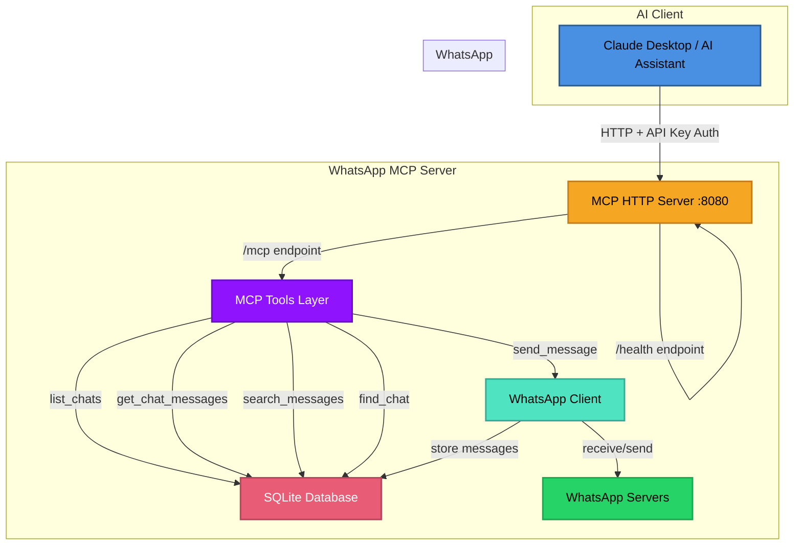

# WhatsApp MCP

A Model Context Protocol (MCP) server that connects WhatsApp to AI assistants, enabling them to read and send messages on your behalf.

## Motivation

**I want AI to reply to messages for me.**

This project exposes your WhatsApp messages and conversations to AI models through MCP tools, allowing them to:
- Read your chat history
- Search for specific messages
- Find conversations
- Send messages and replies

Connect this to Claude Desktop (or any MCP-compatible AI assistant) and let AI handle your WhatsApp conversations.

## Architecture

The WhatsApp interface is built on [whatsmeow](https://github.com/whatsmeow/whatsmeow), and the MCP server uses [mcp-go](https://github.com/mark3labs/mcp-go).



### How it works

1. **Connection**: The server connects to WhatsApp via the whatsmeow library
2. **History Sync**: On first connection, WhatsApp sends a HistorySync event with your message history
3. **Real-time Storage**: All incoming and outgoing messages are stored in a local SQLite database
4. **MCP Exposure**: The database and WhatsApp client are exposed through 5 MCP tools
5. **AI Integration**: AI assistants can call these tools to interact with your WhatsApp

### MCP Tools

- **list_chats** - List all conversations (DMs and groups) ordered by recent activity
- **get_chat_messages** - Retrieve message history from a specific chat
- **search_messages** - Search for messages across all chats by text content
- **find_chat** - Find a specific chat by name or JID
- **send_message** - Send a text message to any chat

## Setup

### Prerequisites

- Go 1.25.5 or higher (for local setup)
- Docker and Docker Compose (for Docker setup)
- A WhatsApp account

### Getting Started

**First, clone the repository:**

```bash
git clone https://github.com/felipeadeildo/whatsapp-mcp
cd whatsapp-mcp
```

Now choose your preferred setup method:

### Option 1: Docker Setup (Recommended)

1. **Create and configure environment file**
   ```bash
   cp .env.example .env
   ```
   Edit `.env` and configure your settings (read the comments in `.env.example`)

2. **Start the server**
   ```bash
   docker compose up -d
   ```

3. **Continue to Initial Setup section below**

### Option 2: Local Setup

1. **Install dependencies**
   ```bash
   go mod download
   ```

2. **Set environment variables**

   Export the variables defined in `.env.example` or create a `.env` file

3. **Run the server**
   ```bash
   go run main.go
   ```

4. **Continue to Initial Setup section below**

---

### Initial Setup - WhatsApp Authentication

**On first run, you need to link your WhatsApp account:**

1. The QR code will be displayed in your terminal as ASCII art
2. A `qr.png` file will also be saved (in current directory or container)
3. Scan it with WhatsApp mobile app:
   - **Settings → Linked Devices → Link a Device**

**Important notes:**
- QR codes refresh every ~60 seconds - scan quickly!
- If you can't see the ASCII art, check the `qr.png` file
- **Docker users:** View logs with `docker compose logs -f whatsapp-mcp`

Once authenticated, the session is saved - you won't need to scan again unless you manually disconnect.

**Verify the server is running:**
```bash
curl http://localhost:8080/health
# Expected: "OK"
```

### Data Persistence

All data is stored in the `./data/` directory:
- `messages.db` - SQLite database with all messages and chats
- `whatsapp_auth.db` - WhatsApp session authentication data

**⚠️ Important:** Keep these files safe! The `whatsapp_auth.db` contains your WhatsApp session credentials.

## Usage

The MCP server exposes an HTTP endpoint that any MCP-compatible client can connect to.

### Endpoint Configuration

- **URL:** `http://localhost:8080/mcp/{API_KEY}`
- **Transport:** HTTP with SSE (Server-Sent Events)
- **Authentication:** API key in URL path

### Client Configuration

Configure your MCP client to connect to the server:

```json
{
  "url": "http://localhost:8080/mcp/your-secret-api-key-here",
  "transport": "http"
}
```

## Production & Security

**For production deployments:**

- **Use a reverse proxy** (nginx, Caddy, Traefik) for HTTPS/TLS, domain routing, and rate limiting
- **Strong API key** - Generate with `openssl rand -base64 32`, never commit to git
- **Firewall** - Don't expose port 8080 directly to the internet
- **Session data** - Keep `whatsapp_auth.db` secure (file permissions 600) and backed up

## Roadmap

### ✅ Implemented

- **Message Storage** - Real-time message syncing to SQLite database
- **WhatsApp Integration** - Full WhatsApp client via whatsmeow library
- **MCP Server** - HTTP-based MCP server with some core tools
- **Docker Deployment** - Containerized setup for easy deployment
- **Authentication** - API key in URL path authentication
- **Health Monitoring** - Health check endpoint for status monitoring

### 🚧 Planned Features

- **Media Transcription** - Support for audio, image, video, and contact messages
  - Automatic transcription of voice messages
  - OCR for images and documents
  - Video metadata extraction
  - Contact card parsing

- **Knowledge Graph** - GraphRAG implementation for intelligent message retrieval
  - Entity extraction from conversations
  - Relationship mapping between contacts
  - Semantic search capabilities
  - Context-aware message recommendations

- **Enhanced Tools**
  - Mark messages as read
  - React to messages
  - Send media files
  - Group management (create, add/remove members)
  - Status updates

- **Analytics Dashboard** (maybe)
  - Message statistics
  - Conversation insights
  - Response time tracking

## Note

This is a personal side project that I maintain for daily use. I don't have time to answer every DM or feature request. Feel free to fork and adapt it to your needs!