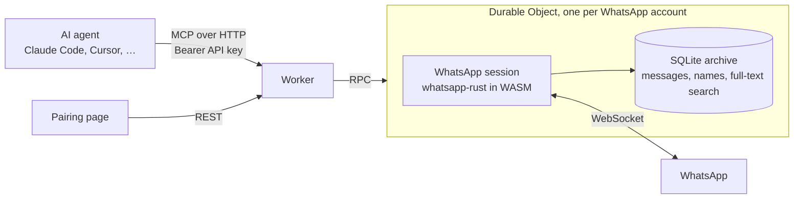

<div align="center">

# whatsapp-mcp

Give your AI agents your WhatsApp.

[](https://modelcontextprotocol.io) [](https://developers.cloudflare.com/durable-objects/) [](LICENSE)

[](https://deploy.workers.cloudflare.com/?url=https://github.com/felipeadeildo/whatsapp-mcp)

[Deploy](#deploy) &nbsp;|&nbsp; [Link your WhatsApp](#link-your-whatsapp) &nbsp;|&nbsp; [Connect your agent](#connect-your-agent) &nbsp;|&nbsp; [Tools](#tools)

<br>


</div>

An [MCP](https://modelcontextprotocol.io) server on Cloudflare that links to your account the way WhatsApp Web does, keeps a searchable archive of your chats, and lets agents read, search and send messages. Each WhatsApp account gets its own Durable Object, and there is no server for you to run.

Once linked, ask your agent things like:

- "What did Marina say about the trip?"
- "Which chats have unread messages since yesterday, and what do they want from me?"
- "Find the address João sent me in March."
- "Reply to the last message in the family group saying I'll be late."

## How it works


```mermaid
flowchart LR
  agent["AI agent<br/>Claude Code, Cursor, …"] -- "MCP over HTTP<br/>Bearer API key" --> worker["Worker"]
  browser["Pairing page"] -- "REST" --> worker
  worker -- "RPC" --> account
  subgraph account["Durable Object, one per WhatsApp account"]
    socket["WhatsApp session<br/>whatsapp-rust in WASM"]
    archive[("SQLite archive<br/>messages, names, full-text search")]
    socket --> archive
  end
  socket <-- "WebSocket" --> whatsapp["WhatsApp"]
```

The WhatsApp session runs inside the Durable Object, which holds the outbound WebSocket to WhatsApp. It uses [baileyrs](https://github.com/oxidezap/baileyrs), a Baileys-compatible library whose protocol core is [whatsapp-rust](https://github.com/oxidezap/whatsapp-rust) compiled to WebAssembly. A 30-second alarm keeps the object in memory and rebuilds the session after deploys and evictions. The Rust engine retries short drops by itself.

The archive lives in the Durable Object's SQLite. WhatsApp sends your recent history once, when you link, and the archive adds everything that arrives afterwards. Search uses SQLite FTS5 and ignores accents and case. Each message also keeps the raw protobuf WhatsApp sent, so replies, reactions, edits and receipts reference it exactly as WhatsApp expects.

WhatsApp addresses the same person by phone number or by an anonymous ID called a LID, and the archive treats both as one person. It keeps every name it sees for someone with its source: your address book, the name they chose on WhatsApp, a business name, a group subject. Results show the best one, and search matches all of them, including past names.

The MCP endpoint is stateless. It uses the Cloudflare [Agents SDK](https://developers.cloudflare.com/agents/model-context-protocol/) with MCP SDK v2, and every request builds a fresh server that calls into the account's Durable Object.

## Deploy

You need a Cloudflare account and a WhatsApp account. Read [Privacy and risk](#privacy-and-risk) before you link one.

### One click

The **Deploy to Cloudflare** button copies this repository to your GitHub, asks for an `API_KEY`, and deploys it. Every push to your copy deploys again.

Generate the key with `openssl rand -hex 32` and keep it in your password manager. Anyone holding it can read and send your messages.

### From your own fork, with Workers Builds

1. Fork this repository.
2. Create the Worker and its secret first, because a deploy fails while `API_KEY` is missing:
   ```sh
   bun install
   bunx wrangler secret put API_KEY
   ```
   Pick your account, accept creating the `whatsapp-mcp` Worker, and paste the key.
3. In the Cloudflare dashboard, open **Workers & Pages → whatsapp-mcp → Settings → Build → Connect**. Authorize GitHub for your fork and set the build:

   | Setting        | Value                                                  |
   | -------------- | ------------------------------------------------------ |
   | Branch         | `main`                                                 |
   | Build command  | Leave empty                                            |
   | Deploy command | `npx wrangler deploy --var TIMEZONE:America/Sao_Paulo` |

   Replace `America/Sao_Paulo` with your time zone. Every push to the branch now deploys.

### From your machine

```sh
bun install
bunx wrangler secret put API_KEY
bun run deploy
```

## Link your WhatsApp

Open the pairing page of an account with your API key after `#`:

```
https://whatsapp-mcp.<your-subdomain>.workers.dev/accounts/personal#<API_KEY>
```

Browsers never send the part after `#` to the server. `personal` is a name you choose, and each name is a separate WhatsApp account, so one deployment can hold several.

Select **Link WhatsApp**. On your phone, open **Settings → Linked devices → Link a device** and scan the code. The page counts your history as it arrives, and once linked it shows how to connect an agent.

<div align="center">

</div>

## Connect your agent

The MCP endpoint is the account's address plus `/mcp`. Send the API key as a Bearer token.

Claude Code:

```sh
claude mcp add --transport http whatsapp \
  https://whatsapp-mcp.<your-subdomain>.workers.dev/accounts/personal/mcp \
  --header "Authorization: Bearer <API_KEY>"
```

Cursor and other clients configured with JSON:

```json
{
  "mcpServers": {
    "whatsapp": {
      "url": "https://whatsapp-mcp.<your-subdomain>.workers.dev/accounts/personal/mcp",
      "headers": { "Authorization": "Bearer <API_KEY>" }
    }
  }
}
```

Clients that connect only through OAuth, such as custom connectors on claude.ai, cannot connect yet.

## Tools

The reading tools answer from the archive, so they work while your phone is offline. They show times in the configured time zone.

| Tool                  | What it does                                                                               |
| --------------------- | ------------------------------------------------------------------------------------------ |
| `get_status`          | Connection state, the linked number, and what the archive holds                            |
| `list_chats`          | Chats in the order your phone shows them, with unread counts and filters                   |
| `find_chats`          | Chats whose names or phone number match, past names included                               |
| `find_people`         | People by any of their names or phone, including group members you never chatted with      |
| `get_messages`        | A chat's messages, oldest first, with paging and filters by date or sender                 |
| `get_message_context` | A message and the conversation around it                                                   |
| `search_messages`     | Full-text search across all chats, ranked, with filters by chat, sender and date           |
| `send_message`        | Sends text, as a reply or with mentions. A retried request does not send the message twice |
| `react_to_message`    | Adds, changes or removes a reaction                                                        |
| `edit_message`        | Edits a message you sent                                                                   |
| `delete_message`      | Deletes a message for everyone                                                             |
| `mark_as_read`        | Marks a chat as read                                                                       |
| `load_older_messages` | Asks your phone for history older than the archive holds                                   |
| `check_numbers`       | Which phone numbers have WhatsApp, without messaging them                                  |
| `get_group_info`      | A group's subject, description, settings and members with their roles                      |
| `get_profile`         | Someone's name, phone, About text and profile picture, as their privacy settings allow     |

Each tool tells the client whether it only reads or changes something other people see, so the client can ask you before it acts. The tools render every kind of message as text, including captions, locations, contacts, polls, events, and business messages with their buttons and lists.

## Configuration

| Name       | Kind     | Purpose                                                         |
| ---------- | -------- | --------------------------------------------------------------- |
| `API_KEY`  | Secret   | Bearer token for the API and the MCP endpoint. Required.        |
| `TIMEZONE` | Variable | IANA time zone the tools show and read dates in. Default `UTC`. |

Set `TIMEZONE` in `wrangler.jsonc` or with `--var TIMEZONE:<zone>` on deploy. The next deploy replaces a value set in the dashboard.

## HTTP API

The pairing page uses a small REST API that also works from scripts. Every call needs `Authorization: Bearer <API_KEY>`.

| Request                     | What it does                                                   |
| --------------------------- | -------------------------------------------------------------- |
| `GET /accounts/:id/status`  | Connection state, the QR code while linking, archive counts    |
| `POST /accounts/:id/start`  | Connects, or starts linking when the account is not linked yet |
| `POST /accounts/:id/send`   | Sends `{ "to", "text", "replyTo"?, "idempotencyKey"? }`        |
| `POST /accounts/:id/logout` | Unlinks the device and deletes the account's archive           |
| `POST /accounts/:id/mcp`    | The MCP endpoint                                               |

## Costs and limits

Each account keeps its Durable Object in memory around the clock. Cloudflare bills that as duration at 128 MB, about 324,000 GB-s per month.

- **Workers Paid** costs $5 per month and includes 400,000 GB-s, which covers one account. Each additional account adds about $4 per month.
- **Workers Free** includes 13,000 GB-s per day, enough for one account. It documents a 10 ms CPU limit per invocation. Nobody has tested yet whether processing the history WhatsApp sends when you link fits under it.
- **Storage** stays small. 33,000 messages take about 40 MB, raw protobufs included, and a Durable Object holds up to 10 GB.

[Durable Objects pricing](https://developers.cloudflare.com/durable-objects/platform/pricing/) has the current numbers.

## Privacy and risk

Your session keys and your archive stay in the account's Durable Object, in your Cloudflare account. The Worker talks only to WhatsApp.

The API key gives full access to the account. If it leaks, replace it with `bunx wrangler secret put API_KEY`.

This project uses the unofficial WhatsApp Web protocol and has no affiliation with WhatsApp or Meta. Using it may break WhatsApp's terms, and WhatsApp can ban accounts that use unofficial clients. Link a number you can afford to lose, and have your agent confirm messages with you before it sends them.

## Development

You need [Bun](https://bun.sh) and a Cloudflare account for `wrangler`.

```sh
bun install
printf 'API_KEY=%s\nTIMEZONE=America/Sao_Paulo\n' "$(openssl rand -hex 32)" > .dev.vars
bun run dev
bun run check
```

`bun install` also installs the pre-commit hooks. `bun run dev` serves the pairing page at `http://localhost:8787/accounts/dev#<API_KEY>` and keeps the local session and archive in `.wrangler/state`. `bun run check` runs the type check, lint, format check and tests. The tests run the archive's real SQL against an in-memory SQLite that has the same interface as the Durable Object's.

## Credits

The WhatsApp session comes from [baileyrs](https://github.com/oxidezap/baileyrs) and [whatsapp-rust](https://github.com/oxidezap/whatsapp-rust) by [oxidezap](https://github.com/oxidezap), whose API follows [Baileys](https://github.com/WhiskeySockets/Baileys). The rules for turning messages into text and for matching people across phone numbers and LIDs follow [mautrix-whatsapp](https://github.com/mautrix/whatsapp) and [whatsmeow](https://github.com/tulir/whatsmeow). The MCP endpoint uses Cloudflare's [Agents SDK](https://github.com/cloudflare/agents).

The previous version of this project, a Go server for Docker, is in the history before this rewrite.

## License

[GPL-3.0](LICENSE)
