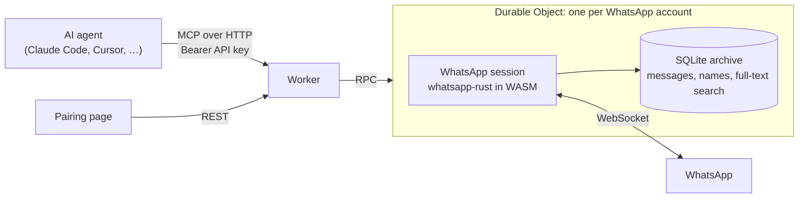

# whatsapp-mcp

Give your AI agents your WhatsApp. An [MCP](https://modelcontextprotocol.io) server that links to your account like WhatsApp Web does, keeps a searchable archive of your chats, and lets agents read, search and send messages. It runs on your own Cloudflare account: one Durable Object per WhatsApp account, no server to maintain.

[](https://deploy.workers.cloudflare.com/?url=https://github.com/felipeadeildo/whatsapp-mcp)


Once linked, ask your agent things like:

- "What did Marina say about the trip?"
- "Which chats have unread messages since yesterday, and what do they want from me?"
- "Find the address João sent me in March."
- "Reply to the last message in the family group saying I'll be late."

## How it works


```mermaid
flowchart LR
  agent["AI agent<br/>(Claude Code, Cursor, …)"] -- "MCP over HTTP<br/>Bearer API key" --> worker["Worker"]
  browser["Pairing page"] -- "REST" --> worker
  worker -- "RPC" --> account
  subgraph account["Durable Object: one per WhatsApp account"]
    socket["WhatsApp session<br/>whatsapp-rust in WASM"]
    archive[("SQLite archive<br/>messages, names, full-text search")]
    socket --> archive
  end
  socket <-- "WebSocket" --> whatsapp["WhatsApp"]
```

- **The session** is [baileyrs](https://github.com/oxidezap/baileyrs), a Baileys-compatible library whose protocol core is [whatsapp-rust](https://github.com/oxidezap/whatsapp-rust) compiled to WebAssembly. It runs inside the Durable Object, which holds the outbound WebSocket to WhatsApp. A 30-second alarm keeps the object in memory and rebuilds the session after deploys and evictions; the Rust engine retries short drops by itself.
- **The archive** lives in the Durable Object's SQLite. WhatsApp sends your recent history once, when you link, and everything that arrives afterwards is added to it. Messages are searchable with SQLite FTS5, ignoring accents and case. Each message also keeps the raw protobuf WhatsApp sent, so replies, reactions, edits and receipts reference it exactly as WhatsApp expects.
- **People** are tracked across their phone number and their anonymous WhatsApp ID (LID), which WhatsApp uses interchangeably. Every name seen for someone is kept with its source: your address book, the name they chose on WhatsApp, a business name, a group subject. Results show the best one, and search matches all of them, past names included.
- **The MCP endpoint** is stateless ([Agents SDK](https://developers.cloudflare.com/agents/model-context-protocol/), MCP SDK v2): every request builds a fresh server that calls into the account's Durable Object.

## Deploy

You need a Cloudflare account and a WhatsApp account you are willing to link to an unofficial client (see [Privacy and risk](#privacy-and-risk)).

### One click

Use the **Deploy to Cloudflare** button above. Cloudflare copies this repository to your GitHub, asks for an `API_KEY`, deploys it, and redeploys on every push to your copy.

Generate the key with `openssl rand -hex 32` and keep it in your password manager. It protects everything: anyone holding it can read and send your messages.

### From your own fork, with Workers Builds

1. Fork this repository.
2. Create the Worker and its secret first, because a deploy fails while `API_KEY` is missing:
   ```sh
   bun install
   bunx wrangler secret put API_KEY
   ```
   Pick your account, accept creating the `whatsapp-mcp` Worker, and paste the key.
3. In the Cloudflare dashboard, open **Workers & Pages → whatsapp-mcp → Settings → Build → Connect**, authorize GitHub for your fork, and set:

   | Setting        | Value                                                                           |
   | -------------- | ------------------------------------------------------------------------------- |
   | Branch         | `main`                                                                          |
   | Build command  | _(empty)_                                                                       |
   | Deploy command | `npx wrangler deploy --var TIMEZONE:America/Sao_Paulo` (use your own time zone) |

   Every push to the branch now deploys.

### From your machine

```sh
bun install
bunx wrangler secret put API_KEY
bun run deploy
```

## Link your WhatsApp

Open the pairing page of an account, with your API key after `#`:

```
https://whatsapp-mcp.<your-subdomain>.workers.dev/accounts/personal#<API_KEY>
```

`personal` is any name you choose; each name is a separate WhatsApp account, so one deployment can hold several. The key stays in the part of the address browsers never send to the server.

Select **Link WhatsApp**, then on your phone open **Settings → Linked devices → Link a device** and scan the code. The page shows your history arriving and, once linked, how to connect an agent.


## Connect your agent

The MCP endpoint is the account's address plus `/mcp`, authenticated with the API key as a Bearer token.

**Claude Code**

```sh
claude mcp add --transport http whatsapp \
  https://whatsapp-mcp.<your-subdomain>.workers.dev/accounts/personal/mcp \
  --header "Authorization: Bearer <API_KEY>"
```

**Cursor, and clients configured with JSON**

```json
{
  "mcpServers": {
    "whatsapp": {
      "url": "https://whatsapp-mcp.<your-subdomain>.workers.dev/accounts/personal/mcp",
      "headers": { "Authorization": "Bearer <API_KEY>" }
    }
  }
}
```

Clients that only connect through OAuth, such as custom connectors on claude.ai, are not supported yet.

## Tools

Reading tools answer from the archive and work even while the phone is offline. Times are shown in the configured time zone.

| Tool                  | What it does                                                                                          |
| --------------------- | ----------------------------------------------------------------------------------------------------- |
| `get_status`          | Connection state, the linked number, and what the archive holds                                       |
| `list_chats`          | Chats in the order the phone shows them, with unread counts; filter by groups, direct chats or unread |
| `find_chats`          | Chats whose names or phone number match, including past names                                         |
| `find_people`         | People by any of their names or phone, including group members you never chatted with                 |
| `get_messages`        | A chat's messages, oldest first, with paging and date or sender filters                               |
| `get_message_context` | A message with the conversation around it                                                             |
| `search_messages`     | Full-text search across all chats, ranked, with chat, sender and date filters                         |
| `send_message`        | Send text, optionally as a reply or with mentions; retries are deduplicated so nothing is sent twice  |
| `react_to_message`    | Add, change or remove a reaction                                                                      |
| `edit_message`        | Edit a message you sent                                                                               |
| `delete_message`      | Delete a message for everyone                                                                         |
| `mark_as_read`        | Mark a chat as read                                                                                   |
| `load_older_messages` | Ask the phone for history older than what the archive holds                                           |
| `check_numbers`       | Which phone numbers have WhatsApp, without messaging them                                             |
| `get_group_info`      | A group's subject, description, settings and members with their roles                                 |
| `get_profile`         | Someone's name, phone, About text and profile picture, as their privacy settings allow                |

Every tool declares whether it only reads or changes something visible to others, so clients can ask before acting. Messages of every kind are rendered as text: captions, locations, contacts, polls, events, and business messages with their buttons and lists.

## Configuration

| Name       | Kind     | Purpose                                                         |
| ---------- | -------- | --------------------------------------------------------------- |
| `API_KEY`  | Secret   | Bearer token for the API and the MCP endpoint. Required.        |
| `TIMEZONE` | Variable | IANA time zone tools show and read dates in. Defaults to `UTC`. |

`TIMEZONE` is set in `wrangler.jsonc` or with `--var TIMEZONE:<zone>` on deploy. A value set in the dashboard is replaced by the next deploy.

## HTTP API

The pairing page uses a small REST API, also handy for scripts. Every call needs `Authorization: Bearer <API_KEY>`.

| Request                     | Does                                                            |
| --------------------------- | --------------------------------------------------------------- |
| `GET /accounts/:id/status`  | Connection state, current QR code while linking, archive counts |
| `POST /accounts/:id/start`  | Connect, or start linking when the account is not linked yet    |
| `POST /accounts/:id/send`   | Send `{ "to", "text", "replyTo"?, "idempotencyKey"? }`          |
| `POST /accounts/:id/logout` | Unlink the device and delete the account's archive              |
| `POST /accounts/:id/mcp`    | The MCP endpoint                                                |

## Costs and limits

An account keeps its Durable Object in memory around the clock, which Cloudflare bills as duration at 128 MB.

- **Workers Paid ($5/month)** is the recommended plan. Its included 400,000 GB-s per month cover one always-on account (about 324,000 GB-s); each additional account adds roughly $4 per month.
- **Workers Free** includes 13,000 GB-s per day, enough for one account (about 10,800). It documents a 10 ms CPU limit per invocation, and whether processing the history WhatsApp sends when you link fits under it has not been tested.
- **Storage** is small: about 40 MB for 33,000 messages, raw protobufs included. A Durable Object holds up to 10 GB.

Check [Durable Objects pricing](https://developers.cloudflare.com/durable-objects/platform/pricing/) for current numbers.

## Privacy and risk

- Your session keys and archive stay in your Cloudflare account, in the account's Durable Object. Nothing is sent anywhere else.
- The API key grants full access to the account. Keep it secret, and rotate it with `wrangler secret put API_KEY` if it leaks.
- This project uses the unofficial WhatsApp Web protocol. It is not affiliated with WhatsApp or Meta, using it may break WhatsApp's terms, and accounts using unofficial clients can be banned. Prefer a number you can afford to lose, and let agents send messages with care.

## Development

Requires [Bun](https://bun.sh) and a Cloudflare account for `wrangler`.

```sh
bun install                      # also installs the pre-commit hooks
printf 'API_KEY=%s\nTIMEZONE=America/Sao_Paulo\n' "$(openssl rand -hex 32)" > .dev.vars
bun run dev                      # http://localhost:8787/accounts/dev#<API_KEY>
bun run check                    # types, lint, format and tests
```

Local state (session and archive) lives in `.wrangler/state`. Tests run the archive's real SQL against an in-memory SQLite with the same interface as the Durable Object's.

```
src/
  index.ts            routes /accounts/:id/* to the account's Durable Object
  account.ts          the Durable Object: session lifecycle, RPC for the API and tools
  mcp/server.ts       MCP tools and how results are presented to the model
  pairing-page.ts     the linking page
  whatsapp/           socket setup, message normalization, event-to-archive sync
  store/              the archive, names and identity, the session key store
test/                 bun test suites
patches/              a one-line fix to baileyrs for bundled runtimes
```

## Credits

Built on [baileyrs](https://github.com/oxidezap/baileyrs) and [whatsapp-rust](https://github.com/oxidezap/whatsapp-rust) by [oxidezap](https://github.com/oxidezap), with an API that follows [Baileys](https://github.com/WhiskeySockets/Baileys). How messages become text and how people are identified across phone numbers and LIDs follow [mautrix-whatsapp](https://github.com/mautrix/whatsapp) and [whatsmeow](https://github.com/tulir/whatsmeow). The MCP endpoint uses Cloudflare's [Agents SDK](https://github.com/cloudflare/agents).

The previous version of this project, a Go server for Docker, is in the history before this rewrite.

## License

[GPL-3.0](LICENSE)
