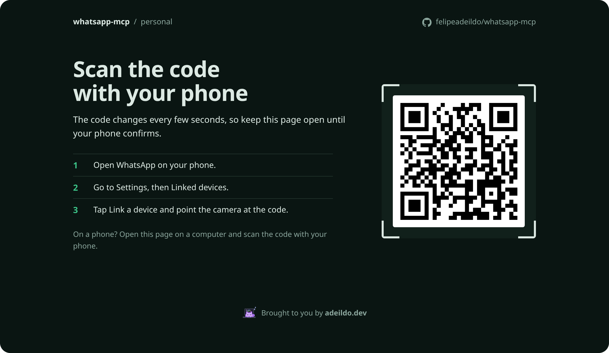
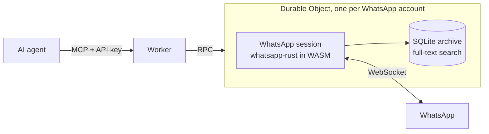
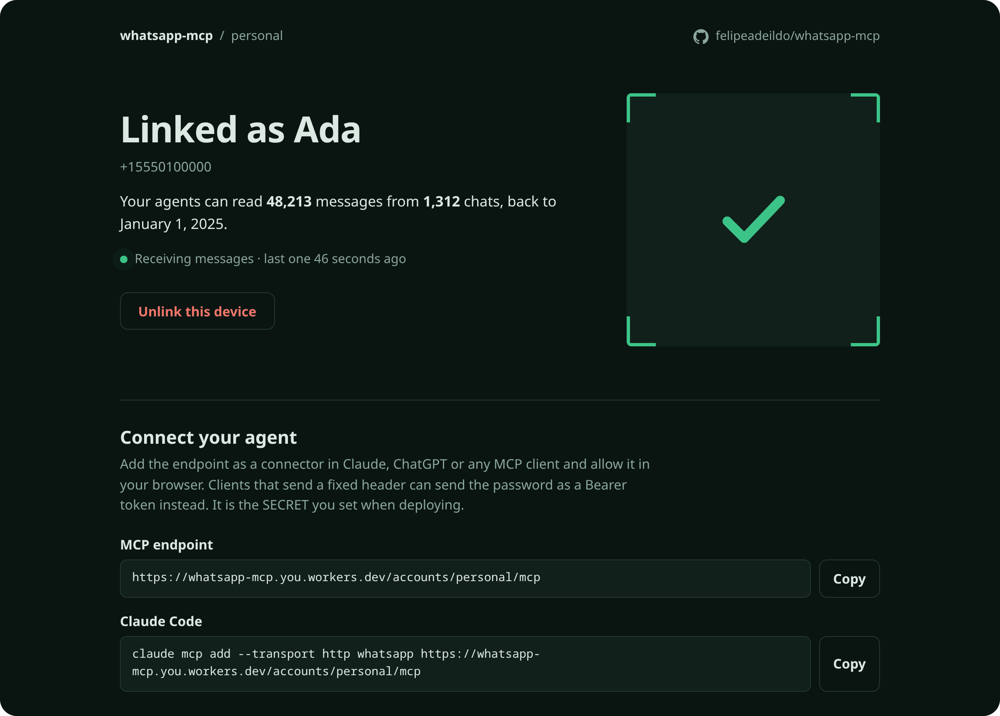

<div align="center">

# whatsapp-mcp

**Give your AI agents your WhatsApp.**

[](https://modelcontextprotocol.io) [](https://developers.cloudflare.com/durable-objects/) [](LICENSE)

[](https://deploy.workers.cloudflare.com/?url=https://github.com/felipeadeildo/whatsapp-mcp)

<br>



</div>

An [MCP](https://modelcontextprotocol.io) server that links to your WhatsApp the way WhatsApp Web does, keeps a searchable archive of your chats, and lets agents read, search and send messages. It runs on your own Cloudflare account, one Durable Object per WhatsApp account.

Once linked, ask your agent things like:

- "What did Marina say about the trip?"
- "Which chats have unread messages since yesterday?"
- "Reply to the family group saying I'll be late."

## How it works


```mermaid
flowchart LR
  agent["AI agent"] -- "MCP + API key" --> worker["Worker"]
  worker -- "RPC" --> account
  subgraph account["Durable Object, one per WhatsApp account"]
    socket["WhatsApp session<br/>whatsapp-rust in WASM"]
    archive[("SQLite archive<br/>full-text search")]
    socket --> archive
  end
  socket <-- "WebSocket" --> whatsapp["WhatsApp"]
```

The session is [baileyrs](https://github.com/oxidezap/baileyrs), whose protocol core is [whatsapp-rust](https://github.com/oxidezap/whatsapp-rust) compiled to WebAssembly. A 30-second alarm keeps the Durable Object in memory and reconnects it after deploys.

WhatsApp sends your recent history once, when you link, and the archive keeps everything after that. Search ignores accents and case, and finds people by any name they have had.

## Deploy

Click **Deploy to Cloudflare** above. It copies the repository to your GitHub, asks for an `API_KEY` and deploys. Generate the key with `openssl rand -hex 32`. Anyone holding it can read and send your messages.

From your machine:

```sh
bun install
bunx wrangler secret put API_KEY
bun run deploy
```

## Link your WhatsApp

Open this page with your API key after `#`, select **Link WhatsApp** and scan the code from **Settings → Linked devices** on your phone:

```
https://whatsapp-mcp.<your-subdomain>.workers.dev/accounts/personal#<API_KEY>
```

`personal` is any name you choose. Each name is a separate WhatsApp account.

<div align="center">

</div>

## Connect your agent

```sh
claude mcp add --transport http whatsapp \
  https://whatsapp-mcp.<your-subdomain>.workers.dev/accounts/personal/mcp \
  --header "Authorization: Bearer <API_KEY>"
```

Other clients take the same URL with the key in an `Authorization: Bearer` header.

## Tools

| Tool                  | What it does                                                    |
| --------------------- | --------------------------------------------------------------- |
| `get_status`          | Connection state and what the archive holds                     |
| `list_chats`          | Chats in phone order, with unread counts                        |
| `find_chats`          | Chats by any name or phone number                               |
| `find_people`         | People by any name or phone, including group members            |
| `get_messages`        | A chat's messages, with paging and date or sender filters       |
| `get_message_context` | A message and the conversation around it                        |
| `search_messages`     | Full-text search across all chats                               |
| `send_message`        | Sends text, as a reply or with mentions, never twice on retries |
| `react_to_message`    | Adds or removes a reaction                                      |
| `edit_message`        | Edits a message you sent                                        |
| `delete_message`      | Deletes a message for everyone                                  |
| `mark_as_read`        | Marks a chat as read                                            |
| `save_contact`        | Saves or renames someone in your address book, on every device  |
| `remove_contact`      | Removes someone from your address book, on every device         |
| `load_older_messages` | Asks your phone for older history                               |
| `check_numbers`       | Which phone numbers have WhatsApp                               |
| `get_group_info`      | A group's details and members                                   |
| `get_profile`         | Someone's name, About text and picture                          |

The pairing page also uses a small REST API under `/accounts/:id`: `status`, `start`, `send` and `logout`.

## Configuration

| Name       | Kind     | Purpose                                                                            |
| ---------- | -------- | ---------------------------------------------------------------------------------- |
| `API_KEY`  | Secret   | Bearer token for every endpoint                                                    |
| `TIMEZONE` | Variable | Time zone for dates, `UTC` by default. Set it in `wrangler.jsonc` or with `--var`. |

## Costs and risk

An account keeps its Durable Object in memory all the time. On Workers Paid ($5 per month) that fits in the included usage, and each extra account costs about $4 per month. The Free plan covers one account, but its CPU limit has not been tested against the history sync. Current numbers are in [Durable Objects pricing](https://developers.cloudflare.com/durable-objects/platform/pricing/) and [Workers limits](https://developers.cloudflare.com/workers/platform/limits/).

This is an unofficial WhatsApp client with no affiliation to WhatsApp or Meta. WhatsApp can ban accounts that use one, so link a number you can afford to lose.

## Development

```sh
bun install
printf 'API_KEY=%s\nTIMEZONE=UTC\n' "$(openssl rand -hex 32)" > .dev.vars
bun run dev     # http://localhost:8787/accounts/dev#<API_KEY>
bun run check   # types, lint, format and tests
```

Built on [baileyrs](https://github.com/oxidezap/baileyrs) and [whatsapp-rust](https://github.com/oxidezap/whatsapp-rust). Message rendering and identity rules follow [mautrix-whatsapp](https://github.com/mautrix/whatsapp). Licensed under [GPL-3.0](LICENSE).

<br>

<div align="center">
<a href="https://adeildo.dev"></a>
<br>
<sub>Brought to you by <a href="https://adeildo.dev">adeildo.dev</a></sub>
</div>
